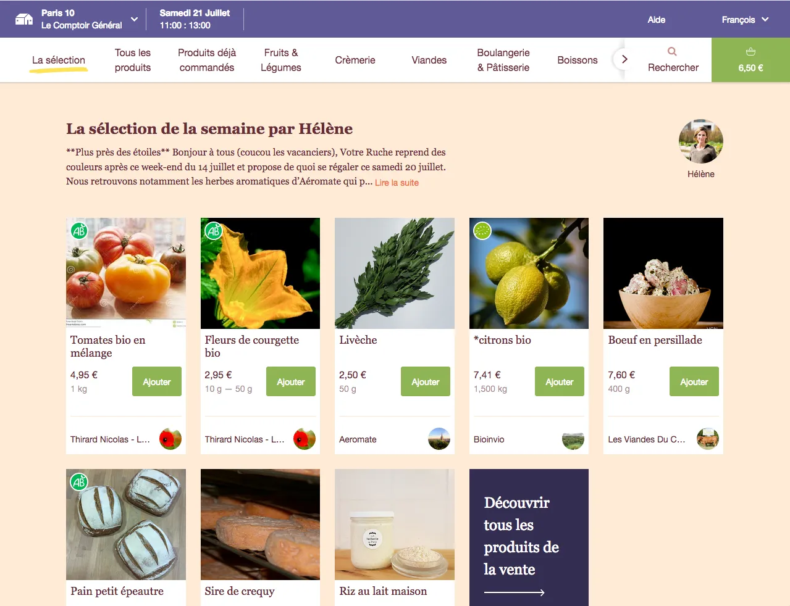
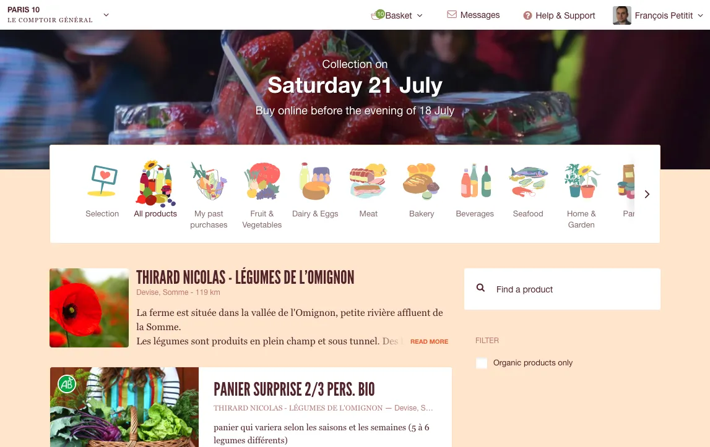
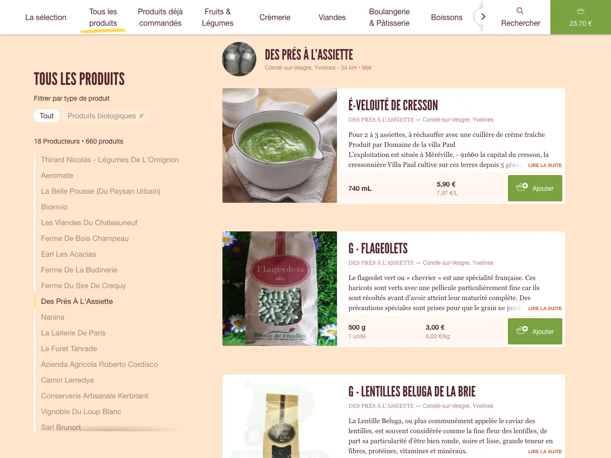
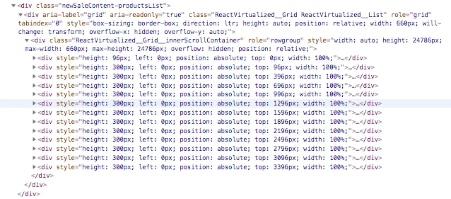
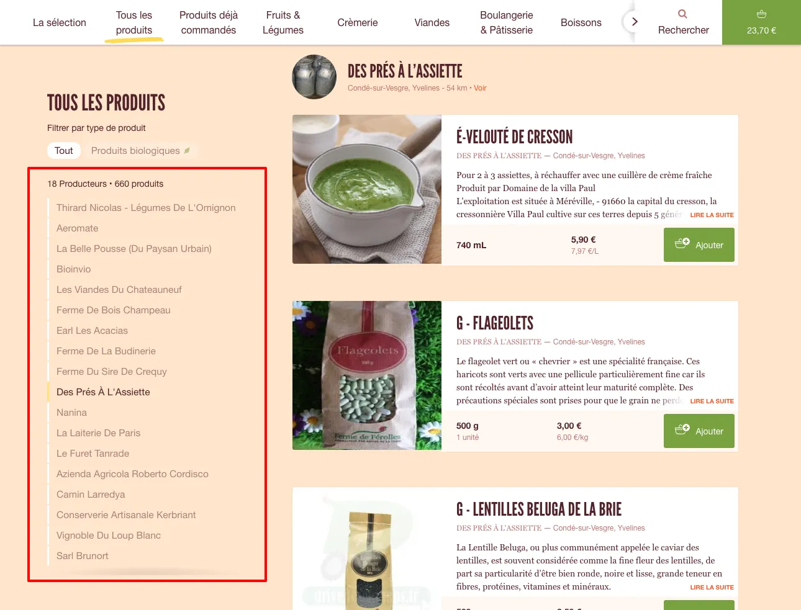

+++
title = 'How We Used React Virtualized to Boost Our Sale Page'
date = 2018-07-18T09:52:49+02:00
draft = false
author = 'François Petitit'
+++

This article was previously published here : https://medium.com/la-ruche-qui-dit-oui/how-we-used-react-virtualized-to-boost-our-sale-page-6e2f087039ca

# How we used React Virtualized to boost our sale page

Our mission at [La Ruche qui dit Oui !](https://laruchequiditoui.fr/fr) is to provide good and fair products to our customers, directly from farmers and craftsmen.

Since last year, we have been working to improve and expand our product offerings, bringing more and more producers and more and more products to our customers.

Challenges arise at many levels: logistics, communication, marketing, but also the user experience offered by our website.

This article focuses on what we did, as Web developers, to handle more and more farmers and more and more products on our new sale page :

But before getting to the code, let’s see what we wanted to change on this page.

## The old sale page: why we chose to abandon it

The sale page looked like that, until the last few weeks:

When this page was designed and implemented, there were only dozens or a few hundreds products per sale. It worked fine at the beginning, but as the number of offers was growing up, we identified some limitations that were problematic:

- a fundamental pattern of our navigation wasn’t understood by the user, especially the newcomers: the products are ordered by farms (because we want to highlight our farmers). Some users dropped their orders or had to spend more time to compare the products, and as you know, on a e-commerce website, more time means less sales…
- on iOS devices, the browser crashed when there were too many products — due to a lack of memory. We used a pagination but it made the sale harder to navigate.
- on large screens, the products were also displayed by batches of 20: when the user was coming to a category, the first 20 were displayed, then when the user scrolled to the bottom, the next 20 were added at the bottom of the list, and so on. Fast scrolling navigation was a bit jerky.
- on large screen, the page didn’t use all the width of the page: it was a shame because we could have displayed more products.
- access to categories, subcategories and organic filters was only possible when the user was on top of the page. Discovering the whole range of products was not easy and organic filters deserved to be more visible.

So, we needed to improve the discoverability of the whole catalog, and the navigation inside it.

After a few weeks of user testing and design adjustments, we finally decided to implement this new page:

The main technical challenge of the new sale page was the “all products” category:

As you may guess viewing the screenshot, there are now 2 ways to navigate inside a category:

- the user can scroll into the products list, from the first product to the last one (sometimes there are more than 2000 products).
- or the user can click on a farm in the farms list on the left side: the list will automatically scroll up or down to the first product of the farmer.

So, let’s see how we handled displaying long lists and browsing into them in our code.

## Handle long list with React : React-virtualized

At La Ruche qui dit Oui !, we chose about 2 years ago to develop all our new Web front-end features with React.

React is very powerful to manipulate the DOM efficiently thanks to its use of shadow DOM. We aim to provide the most fluid and responsive interfaces thanks to React.

In its documentation, React provides some guidelines to optimize performances. In particular, there is a paragraph about “Virtualize Long Lists” :

> Virtualize Long Lists
>
> If your application renders long lists of data (hundreds or thousands of rows), we recommended using a technique known as “windowing”. This technique only renders a small subset of your rows at any given time, and can dramatically reduce the time it takes to re-render the components as well as the number of DOM nodes created.
>
> React Virtualized is one popular windowing library. It provides several reusable components for displaying lists, grids, and tabular data. You can also create your own windowing component, like Twitter did, if you want something more tailored to your application’s specific use case.

Windowing is pretty easy to understand with the capture below, displaying the content of the DOM at a precise moment : only a dozen of rows are rendered into the DOM, no matter the total number of rows. React Virtualized will remove the rows that are no longer visible and add the newly visible each time the user scrolls into the page.

So as the documentation mentioned React Virtualized, and as it seemed to handle our use cases, we chose to use it to implement the new features.

## How we use React Virtualized

We managed to isolate all our usage of React Virtualized in only one component, called “ProductsList.jsx”.

Finally, we used 2 components from the library: List and WindowScroller. Our imports look like this:

Note that the explicit path used in the import directives are due to the recommendation from [here](https://medium.com/la-ruche-qui-dit-oui/how-we-used-react-virtualized-to-boost-our-sale-page-6e2f087039ca#:~:text=the%20recommendation%20from-,here,-and%20could%20be) and could be removed if you’re using Webpack 4.

`List` allows to display a windowed list of elements.

`WindowScroller` allows the `List` component to be scrolled based on the window's scroll positions. Also, the scrollbar will reflect the length of the list and the current position.

Now let’s render these components in the `render` function of our `ProductsList` component:

The properties passed to the List component can be divided in 3 parts: the content of the list, the dimensions of the list, and handling the user interactions.

###The content of the list

Giving the content is done by passing a function as the rowRenderer property, that will return the React component corresponding to the index of the desired row:

(R is for [RamdaJS](http://ramdajs.com/))

Where farmsAndProductsComponents is a pre-computed array that contains React components displaying either a farmer card or a product card. This part of the code is pretty obvious, but will be complicated to handle the dimension of the list.

### Handling the dimension of the list

One of the key thing that must be done to handle the scrollbar of the window is to be able to know the size of the entire list.

So we set fixed height to our components, according to their types (farmer card or product card) and the width of the window (the cards heights are bigger on small screen than on large screen), and passed the function as the rowHeight prop:

### Handling the user interaction

If we stopped here, the user could scroll into the list, use the scrollbar, and know where it situated into the list.

But we wanted to provide an other way to navigate, by displaying the list of the producers, displaying the current producer (the one corresponding to the first visible product in the screen), and going to an other producer by clicking on its name. This is the purpose of the menu on the left side, in large screen:

The producers list in the sticky menu

### Displaying the current farm

To do that, we added a “scrollY” attribute to our list components:

It allowed us to determine the current producer by looking for the first element of the list having a scrollY visible according to `window.pageYOffset`:

### Going to a specific producer

Finally, going to a specific producer was done by calculating the position of the producer card by accumulating the heights of the previous components from the list and scrolling to the position:

### Conclusion : the pros and cons of React Virtualized

We are quite happy of our new sale page and React Virtualized was really a great tool to help use prototyping and developing all the features that we wanted.

The performance are very good, it works well on all the browsers that we support, especially on the most difficult to support for us which are IE 11 and Safari Mobile on relatively old iOS devices.

We were concerned by 2 problems until now. Both are due to the fact that the whole list is never present into the DOM:

- searching into the list by the find function of the browsers (“ctrl + f”) is working only in the visible rows, but we provide a Search functionality in the sale page that the user should use instead of the browser’s function, and that provides more intelligent results
- some CSS rules cannot be used, for example selectors like [first-of-type](https://developer.mozilla.org/en-US/docs/Web/CSS/:first-of-type)

If you have faced challenges of the same type, please share your experiences in the comments of this blog post :)
