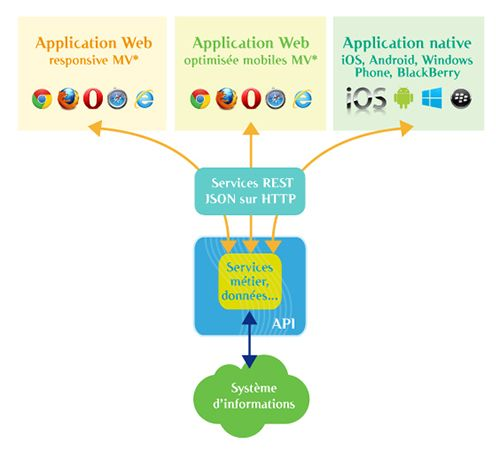
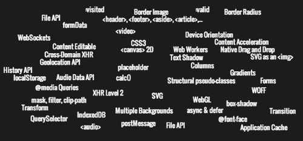

+++
title = 'Les Nouvelles Architectures Web Et Leur Impact Sur Les Dsi Partie 2'
date = 2013-10-30T15:11:39+02:00
draft = false
+++

*cet article a été publié une première fois le 29/10/2013 sur le blog d'OCTO Technology : https://blog.octo.com/les-nouvelles-architectures-front-web-et-leur-impact-sur-la-dsi-partie-2*

Dans la [partie 1 de cet article](https://www.francoispetitit.com/posts/les-nouvelles-architectures-web-et-leur-impact-sur-les-dsi-partie-1/), nous avons traité des nouvelles architectures front-end basées sur des applications Web massivement Javascript appelant des API offertes par un serveur back-end : les nouvelles architectures front Web et leur impact sur les DSI - Partie 1.

Nous avons vu qu'elles sont apparues ces dernières années grâce à l'augmentation des performances des navigateurs et à l'amélioration des outils d'industrialisation des développements Javascript.

Dans cette seconde partie, nous nous intéresserons aux raisons pour lesquelles on devrait choisir ces nouvelles architectures, aux opportunités qu'elles offrent, et aux conséquences sur les organisations des directions informatiques.

## Pourquoi utiliser ces nouvelles archis?

### Pour mutualiser le code back-end pour de multiples clients

Un atout majeur de cette architecture est la mise en place d'une API : orientée fonctionnel et développée dans une technologie standard comme JSON sur HTTP, celle-ci pourra être utilisée par de nombreux autres clients que l'application Web initiale. De plus, c'est un pattern d'architecture déjà connu car c'est en général celui utilisé par les applications mobiles : on a donc déjà une certaine expérience dans les DSI pour mettre en place une brique de Web services faisant une façade devant la complexité du SI et utilisable par les applications mobiles. Cependant avec une architecture Web MVC server-side, on aurait dû développer tout d'abord le service côté serveur qui appelle le back-office métier, puis l'expose à l'application Web. Avec une architecture MV* côté client, on n'a plus besoin de cette couche et consommer directement les services de l'API si elle existe déjà. De même, si on part de zéro, on peut investir dès le début sur une API "propre" débarrassée de toute spécificité liée à la technologie utilisée pour les IHM.

### ... et ouvrir une API vers l'extérieur ?

Si vous détenez une API pour vos applications, la rendre accessible à l'extérieur sera d'autant plus facilitée. Je vous invite à relire cet article sur notre blog : les Patterns des Grands du Web : « OpenAPI » ou écosystème ouvert. Cela nécessite bien évidemment d'autres éléments, notamment une démarche particulière et la mise en place d'un écosystème pour les clients de l'API, mais avoir déjà développé les services est une opportunité à bien considérer !

## Pour améliorer la productivité des développements

Avec le recul que nous avons chez OCTO, où l'on a déjà réalisé sur cette architecture et mis en production plus d'une dizaine de projets de tous types, Web mobile ou desktop, applications métier ou de Dataviz, utiliser des technologies comme AngularJS et BackboneJS améliore sensiblement la productivité, par-rapport à utiliser des frameworks MVC server-side comme JSF ou GWT par exemple dans le monde Java. Cela est tout de même plus nuancé si l'on compare avec des outils de développements plus proche du Web comme Rails ou PHP, où les archis MV* côté client conservent tout de même l'avantage de la consommation d'API agnostiques comme vu précédemment. Mais si on a des serveurs sur Java ou .Net par exemple, et qu'on ne veut pas introduire un nouveau middleware dans son infra, alors la productivité des développements front-end avec des technologies comme AngularJS sera un très fort atout.

## Pour produire des applications Web plus puissantes, plus riches, plus ergonomiques

Au-delà de la productivité, il faut aussi comparer le produit final. Or quand on développe avec un framework MV*, on développe toute l'application dans et pour le navigateur. Cela permet au développeur d'accéder directement et facilement à tous les services offerts par celui-ci, et depuis l'avènement de HTML5 ils sont nombreux : stockage de données, offline, accès au système de fichier, multi-threading, push de données... Nous n'exploitons aujourd'hui même pas 10% des capacités de nos navigateurs, et cela non pas par manque de cas d'usages mais par manque de facilités pour le développement JavaScript dans le navigateur. Or justement avec ces nouvelles technologies, on gagne la possibilité d'expérimenter souvent et rapidement car l'environnement de développement est extrêmement rapide (notamment le **live-reload** qui permet de recharger du code dans le navigateur à peine après avoir enregistré un fichier source et à l'utilisation de NodeJs en serveur de développement, beaucoup plus rapide que les serveurs Java ou .Net). On se ré-approprie véritablement le navigateur, qui n'est plus la boîte noire qui vous veut du mal comme quand il fallait sans cesse débugger du code sur les navigateurs standards du marchés. Il est la nouvelle plateforme, qui vous ouvre des nouveaux horizons de créativité.

Combien en utilisez-vous aujourd'hui? Combien en exploiterez-vous dans 1 an?

## Pour remplacer une application lourde complexe et la déployer en SAAS

Les éditeurs sont sont de plus en plus nombreux à porter leurs solutions client lourd vers des technologies Web. On pourra évoquer Google Apps qui fournit un webmail bien connu et une suite office depuis longtemps. Mais on est encore plus frappé par la dernière mouture de Microsoft Office, Office 365, qui est intégralement sur le cloud, et de modèle de vente par licence à des abonnements en mode SAAS. Cela est rendu possible par l'exploitation des nouvelles capacités des navigateurs, et utiliser des architectures MV* massivement Javascript et bien outillées est clairement la solution aujourd'hui pour adresser ces besoins.

Enfin, un domaine jusqu'ici souvent réservé aux applications lourdes est celui des applications métiers complexes. Cela s'expliquait principalement par un manque de performances des technos Web. Les DSI souhaitent généralement se désendetter de technologies de clients lourds comme VB ou Swing, mais peu de nouvelles solutions pérennes et ouvertes ont émergé. Un des derniers challenger était Flex, mais son destin est entre les mains d'Adobe et ne semble guère rassurant. Un autre est .Net avec WPF, lié à l'écosystème Microsoft. GWT avait tenté et réussi à rendre le développement d'applications Web relativement complexes un choix réaliste. Mais de même Google, toujours pionnier en matière technologique, a décidé de réduire ses investissements sur cette plateforme, et d'embaucher les développeurs du framework AngularJS et de développer la plateforme Dart. L'alternative à la conservation des anciennes applications est aujourd'hui à chercher dans les nouvelles architectures Web. On restera tout de même encore mesurés devant un relatif manque de maturité des technologies avant de déclencher des refontes d'applications complexes, non pas que les plateformes elles-mêmes (le Web et les navigateurs) ne soient assez matures, mais que les technologies de développements évoluent très vite et peuvent induire un coût de maintenance non négligeable pour une DSI qui n'est pas "pure player" du Web.

## Quels impacts sur ma DSI?

Les impacts de ces technologies sur la DSI du point de vue technique sont finalement assez faibles : on savait déjà développer et faire tourner des applications Web en production. De même, la mise en place d'une API implique peu de nouveautés et les patterns pour les sécuriser sont déjà connus car utilisés dans les applications mobiles et les RIA.

La nouveauté est plus à chercher dans les compétences requises pour le développement, et notamment en JavaScript.

## Le besoin de nouvelles compétences JavaScript

Il faut revenir à 5 ou 10 ans en arrière pour comprendre l'aversion des DSI au développement en JavaScript. A l'époque, ce langage était très difficilement maintenable car il offre nativement peu de garde-fous : par de typage, pas de compilation, pas de modèle objet... JavaScript était vu comme un langage de bidouilleurs à bannir en production et dont le seul mérite était d'être utilisé par tous les navigateurs. A l'aune du Web 2.0, pour faire des applications Web plus riches, on a donc créé des frameworks de développements pour générer du JavaScript sans en écrire : JSF, GWT, ASP.Net, etc. Les limites engendrées par ces librairies (difficultés à introduire du comportement non standard, complexité de debuggage, dépendances fortes avec les éditeurs de librairies) ainsi que l'illusion de pouvoir confier à des développeurs purement "backs" Java ou .Net ont conduits à des désillusions tant sur les applications produites que sur la productivité.

Avec les nouveaux frameworks MV*, on retrouve une liberté dans les développements et une meilleure productivité, à condition d'accepter de développer directement en JavaScript. Le prix à payer est donc l'acquisition de compétences en JavaScript, et même de nouvelles compétences : typiquement, il ne s'agit plus de savoir intégrer un plug-in jQuery pour apporter un peu de dynamisme à une page web statique, mais de développer une application entière avec du JavaScript et un framework approprié.

Des connaissances en architecture applicative et en industrialisation des développements (tests, etc.) sont un pré-requis pour ces nouvelles technologies. Heureusement, la facilité d'utilisation des derniers frameworks MV* et les cadres structurants qu'ils offrent permettent de réduire très largement le ticket d'entrée pour un développeur encore non expert.

Et c'est bien là le fait majeur de cette évolution : **la prise en main du développement d'applications MV* côté client est désormais aussi aisée que celle d'applications MVC classiques.**

## La tentation de créer des équipes par technos front-end et back-end

Le découplage technologique grandissant entre technologies front Web HTML/CSS/JavaScript et back (sauf à utiliser NodeJS sur le serveur!) engendrent une plus grande distinction entre les développeurs suivant la couche technique sur laquelle ils travaillent. C'est une opportunité d'améliorer l'expertise sur une technologie et la complexification fonctionnelle des applications le nécessite souvent, mais c'est aussi un risque de perdre une certaine polyvalence.

Un autre impact concerne l'organisation des équipes : on pourra plus facilement dédier des équipes au développement front et d'autres au développement back. Mais cette idée a déjà été abordé dans cet article, où l'on constate qu'elle n'est pas forcément le meilleur choix : https://blog.octo.com/feature-team/. En synthèse si vous n'avez pas le temps de le relire, le mode d'organisation le plus efficace est plutôt de grouper les équipes en "feature teams" dédiées à des fonctionnalité et couvrant l'ensemble des compétences nécessaires pour les mettre en place.

## Conclusion : quelques écueils à éviter
En conclusion, on gardera à l'esprit que les nouvelles architecture Web apportent de grandes opportunités pour le développement d'applications et les usages pouvant être faits par les utilisateurs finaux et les DSI.

On évoquera tout de même quelques axes de réflexions à ne pas écarter lors d'un choix de technologies : - ces solutions ne sont pas forcément les meilleurs pour tous les cas d'usages : par exemple pour un site statique, on peut trouver des solutions plus performantes par-rapport aux performances et au référencement - la comparaison avec des applications natives, véritable point de tension dans les choix pour adresser les usages en mobilité, n'est pas encore à l'avantage du Web : il reste toujours de nombreuses choses possibles en natif impossibles en Web. A chaque contexte correspondra une stratégie de choix différente.

## Pour aller plus loin
une présentation de Julien Jakubowski à Devoxx sur l'industrialisation avec JavaScript : http://parleys.com/play/517bf74ee4b0736a5fa66a38/chapter0/about
sur la problématique de référencement de single page application : https://blog.octo.com/seo-spa-angular/